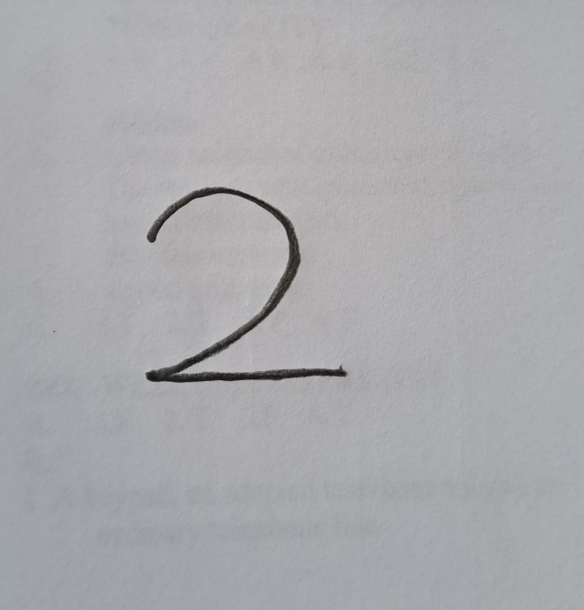

# Real-Time-Digit-Classification
 This project uses deep learning techniques to perform real-time digit classification using a webcam. It leverages a Convolutional Neural Network (CNN) model built with TensorFlow and Keras to classify digits captured by the camera in real-time.

